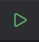
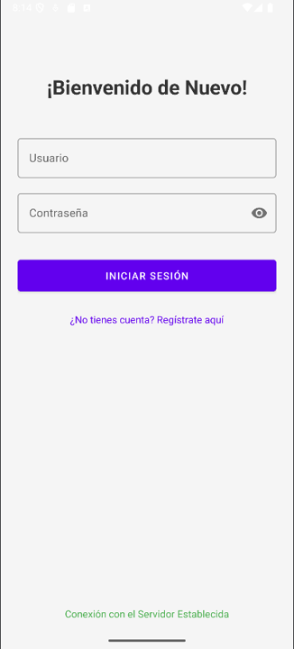
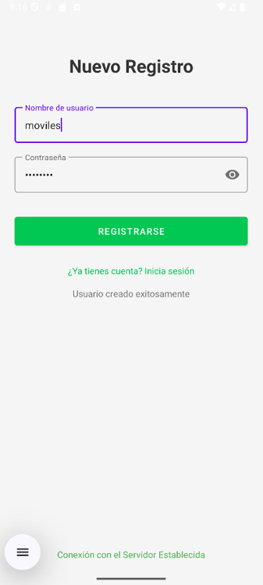
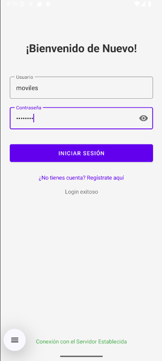
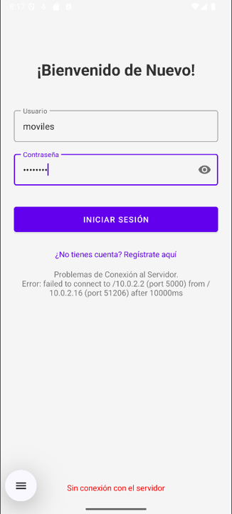

# Tarea 2.- Backend de la Práctica 2

### Nombre:
Gomez Tovar Yoshua Oziel

### Grupo:
7CV4

## Instrucciones de Ejecución
1. Clona el repositorio de GitHub.
2. Abre el proyecto en AndroidStudio.
3. Ejecuta la aplicación con las teclas "Mayus+F10" o con el botón 
4. Se mostrará la pantalla "Inicio de Sesión", donde se podrá ingresar un nombre de usuario y contraseña, posterioemente, se deberá presionar el botón morado para validar la información.
5. En caso de no tener una cuenta, se podrá dar en el texto morado debajo del botón "¿No tienes una cuenta? Registrate aquí".
6. Una vez en la pantalla "Nuevo Registro", se deberá ingresar un el usuario y contraseña deseados para la cuenta, una vez hecho esto, se deberá presionar el botón verde para crear la cuenta.
7. Para ambos casos, al presionar el botón se mostrará un mensaje donde se indicará que el proceso se realizó con éxito o si ocurrió algún error.

NOTA: Es importante tener el servidor corriendo para que la aplicación funcione correctamente.

## Capturas de Pantalla de los Ejercicios

### Ejercicio 1 – Conexión y verificación de la API

  

### Ejercicio 2 – Pantalla de Registro

  

### Ejercicio 3 – Pantalla de Login

  

### Ejercicio 4 – Manejo de errores de red

